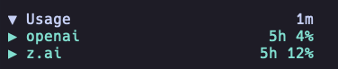
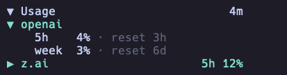
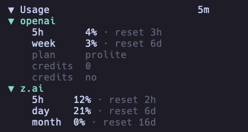

# opencode-usage-monitor

> OpenCode TUI sidebar plugin that shows OpenAI and Z.AI / GLM quota usage without exposing provider credentials in the UI.

[](https://www.npmjs.com/package/opencode-usage-monitor)


| Field | Value |
|---|---|
| Status | Actively maintained personal OpenCode tool/plugin |
| Type | OpenCode TUI plugin / host extension |
| Host app | OpenCode `>= v1.14.49` documented; `@opencode-ai/plugin >=1.4.0` peer dependency |
| Package | `opencode-usage-monitor` `1.0.7`, published on npm |
| Runtime | Bun `>= 1.1.0` documented for local development |
| Maintainer checks | `bun install && bun run build:all && bun test && bun run typecheck` |

## Screenshots

The plugin renders inside the OpenCode terminal UI sidebar.







## Summary

- Displays OpenAI ChatGPT usage windows such as 5h/week with reset timing and optional plan or credits details.
- Displays Z.AI and GLM 5h/day/month quota windows with reset timing and optional plan details.
- Discovers credentials from OpenCode auth storage and supported environment variables.
- Redacts secrets from error messages before rendering them in the TUI.
- Uses stale-data indicators and guarded refreshes to avoid overlapping API calls.
- Supports two-level collapse/expand behavior: the full panel and per-provider detail views.

## Quick start

```sh
# install the published OpenCode plugin globally
opencode plugin opencode-usage-monitor@latest --global --force

# optional: build from a local checkout for development
git clone https://github.com/Mark1708/opencode-usage-monitor.git
cd opencode-usage-monitor
bun install
bun run build:all
```

## Installation

### OpenCode plugin install

```sh
opencode plugin opencode-usage-monitor@latest --global --force
```

This is the recommended path for users because the plugin is published on npm and OpenCode can install it directly.

### Package install for local development

```sh
bun add opencode-usage-monitor
```

Use this when you need the package in a local development workspace rather than installing it into OpenCode globally.

### Local checkout

```sh
git clone https://github.com/Mark1708/opencode-usage-monitor.git
cd opencode-usage-monitor
bun install
bun run build:all
```

The build emits the plugin entry and TUI bundle into `dist/`.

## Compatibility

| Component | Supported version | Source |
|---|---|---|
| Host app | OpenCode `>= v1.14.49` | README compatibility note |
| Plugin API | `@opencode-ai/plugin >=1.4.0` | `package.json` peer dependency |
| TUI runtime | `@opentui/solid >=0.1.0`, `solid-js >=1.8.0` | `package.json` peer dependencies |
| Local runtime | Bun `>=1.1.0` | README requirements; Bun-based scripts in `package.json` |
| TypeScript | `^5.5.0` | `package.json` dev dependency |

## Configuration

The plugin first reads a dedicated config file:

```text
~/.config/opencode/usage-monitor.json
```

Smallest useful configuration:

```json
{
  "enabled": true,
  "show_openai": true,
  "show_zai": true
}
```

Full documented shape:

```json
{
  "enabled": true,
  "default_collapsed": false,
  "default_provider_collapsed": true,
  "debug": false,
  "refresh_ms": 60000,
  "request_timeout_ms": 15000,
  "show_openai": true,
  "show_zai": true,
  "show_details": true,
  "width": 34,
  "symbols": "unicode",
  "max_detail_lines": 4,
  "max_windows": 3,
  "max_model_lines": 1,
  "refresh_keybind": "<leader>q"
}
```

Alternatively, add a `usage_monitor` section to `oh-my-openagent.json`. Dedicated `usage-monitor.json` values take precedence.

## Credentials

### OpenAI

OpenAI organization usage endpoints require an admin key:

```sh
export OPENAI_ADMIN_KEY="your-admin-key"
```

The plugin can detect `OPENAI_API_KEY` or an OpenCode `auth.json` OpenAI entry, but non-admin credentials are marked unsupported for organization usage endpoints.

### Z.AI and GLM

The plugin supports Z.AI and Zhipu / GLM credentials from OpenCode auth storage or environment variables:

```sh
export ZAI_API_KEY="your-zai-key"
export ZAI_CODING_PLAN_API_KEY="your-coding-plan-key"
export ZHIPU_API_KEY="your-zhipu-key"
export ZHIPUAI_API_KEY="your-zhipuai-key"
```

## Usage

- Click the main usage header to collapse or expand the full panel.
- Click provider rows to toggle provider details independently.
- Use `/usage-refresh` or the configured refresh keybind, default `<leader>q`, to refresh manually.
- Cache is stored at `~/.cache/opencode/usage-monitor.json`.
- Render errors are caught and displayed inside an error boundary.

## Project structure

```text
.
├── assets/                    # Local screenshots used by this README
├── dist/                      # Built package output
├── src/
│   ├── auth.ts                # OpenCode auth and environment credential discovery
│   ├── cache.ts               # Usage cache persistence
│   ├── config.ts              # usage-monitor.json and oh-my-openagent config parsing
│   ├── index.ts               # OpenCode plugin entry
│   ├── sanitize.ts            # Secret redaction helpers
│   ├── tui.ts                 # TUI plugin module
│   ├── providers/             # OpenAI and Z.AI provider clients
│   └── views/                 # TUI view rendering helpers
├── package.json               # Package metadata, scripts, peer dependencies
├── tsconfig.json              # Strict TypeScript config
└── LICENSE
```

## Troubleshooting

- If OpenAI shows `needs admin key`, set `OPENAI_ADMIN_KEY` with an organization admin key.
- If Z.AI shows `auth missing`, configure a supported Z.AI or Zhipu environment variable or OpenCode auth entry.
- If the panel is too wide or narrow, adjust `width` in `usage-monitor.json`.
- If refreshes appear stale, lower `refresh_ms` or check provider API connectivity.
- If build output is missing, run `bun run build:all` and verify `dist/index.js` and `dist/tui.js` exist.
- If cached data appears stale, check `~/.cache/opencode/usage-monitor.json`.

## Limitations / Security

- The plugin reads local OpenCode auth metadata and supported environment variables, but examples in this README use placeholders only.
- Secrets are redacted from rendered error messages before they reach the TUI.
- Provider data depends on external OpenAI, Z.AI, and Zhipu API availability and credential permissions.
- The package is a host extension; runtime behavior depends on compatible OpenCode and OpenTUI APIs.

## Status

Actively maintained personal OpenCode tool/plugin. Public issues and improvements are welcome, but the project is primarily maintained around the author's own workflow.

## Links / License

- Package: <https://www.npmjs.com/package/opencode-usage-monitor>
- Repository: <https://github.com/Mark1708/opencode-usage-monitor>
- Host app: <https://opencode.ai/>
- License: MIT, see [`LICENSE`](LICENSE)
